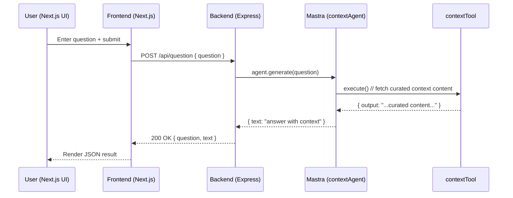
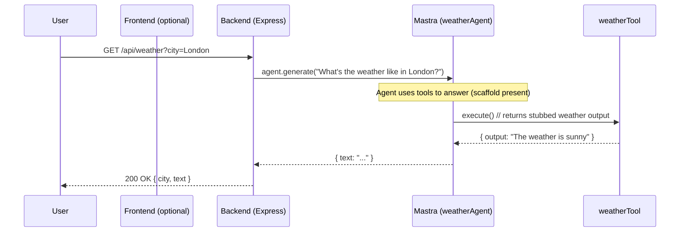

# MCP‑Mastra — Next.js + Express + Mastra Agents

[](https://nodejs.org)
[](https://www.npmjs.com/)
[](https://www.typescriptlang.org/)
[](https://nextjs.org/)
[](https://expressjs.com/)
[](https://www.npmjs.com/package/@mastra/core)
[](https://openai.com/)

An end‑to‑end example showing how a modern Next.js frontend talks to an Express backend powered by Mastra Agents and Tools. The backend exposes simple endpoints for weather and contextual Q&A. The frontend demonstrates a minimal UI that calls these endpoints and renders the JSON response.


### Highlights

- **Frontend**: Next.js 15 (App Router), React 19, lightweight UI primitives (Button, Input), Tailwind utility helpers.
- **Backend**: Express 5, Mastra Agents with custom Tools, OpenAI model integration via `@ai-sdk/openai`.
- **Agents/Tools**: 
  - `contextAgent` uses `contextTool` to return curated content.
  - `weatherAgent` scaffolding in place; a `weatherTool` exists for current weather stubs.


## Architecture

The project is split into two top‑level workspaces: `Frontend/` (Next.js app) and `Backend/` (Express + Mastra).

```mermaid
graph TD
  A[User (Browser)] --> B[Next.js App (Frontend)]
  B -->|fetch/POST| C[Express API (Backend)]
  C --> D[Mastra Runtime]
  D --> E[Agents]
  E --> F[Tools]
  F --> G[(External Services)]

  subgraph Frontend
  B
  end

  subgraph Backend
  C --> D
  D --> E
  E --> F
  end
```


### Request Flow: Context Q&A (`POST /api/question`)




### Request Flow: Weather (`GET /api/weather?city=...`)



Note: In the current scaffold, `weatherTool` returns a static stub and the `weatherAgent` is wired similarly to show the integration pattern. Extend it to call a real weather API as needed.


## Tech Stack

- Frontend:
  - Next.js `15.5.4`, React `19.1.0`, Tailwind helpers (`tailwind-merge`, `clsx`), `lucide-react`
- Backend:
  - Express `5.1.0`, Mastra (`@mastra/core`), `@ai-sdk/openai`, `zod`


## Project Structure

```
/Backend
  package.json
  src/
    index.ts                # Express server: routes and agent calls
    mastra/
      index.ts              # Mastra runtime and agent registry
      agents/
        context-agent.ts    # contextAgent -> uses contextTool + OpenAI model
        weather-agent.ts    # weatherAgent -> scaffold for weather
      tools/
        context-tool.ts     # Returns curated content (stubbed data)
        weather-tool.ts     # Returns stubbed weather output
  tsconfig.json

/Frontend
  package.json
  next.config.ts
  src/
    app/
      page.tsx              # Minimal UI to POST /api/question
      test/page.tsx         # Starter Next.js page
    components/ui/
      button.tsx, input.tsx # Reusable UI primitives
    lib/
      config.ts             # API base + endpoint builders
      utils.ts              # Tailwind className helper
```


## Backend

### Key Endpoints

- `GET /` → Health check: "Hello World"
- `GET /api/v1/auth/login` → Placeholder route
- `GET /api/weather?city=London` → Calls `weatherAgent.generate(...)` and returns `{ city, text }`
- `POST /api/question`
  - Body: `{ "question": "..." }`
  - Calls `mastra.getAgent("contextAgent").generate(question)`
  - Returns `{ question, text }`

### Agents and Tools

- `contextAgent`
  - Model: `openai("gpt-4o-mini")`
  - Tooling: `contextTool` which returns curated content for demonstration
  - Instructions emphasize calling the context tool and telling the user it was used

- `weatherAgent`
  - Model: `openai("gpt-4o-mini")`
  - Tooling scaffold: `weatherTool` (static stub). Extend to call a real weather provider


### Environment Variables

- `OPENAI_API_KEY` (required): Needed by `@ai-sdk/openai` to access OpenAI models.
- `PORT` (optional): Defaults to `3001`.

Create `Backend/.env` (or export in your shell):

```bash
OPENAI_API_KEY=sk-live-or-test-key
PORT=3001
```


### Run the Backend

```bash
cd Backend
npm install
npm run dev
# Server listens on http://localhost:3001
```

### Test the API

```bash
# Health
curl http://localhost:3001/

# Weather (stubbed)
curl "http://localhost:3001/api/weather?city=London"

# Context Q&A
curl -X POST http://localhost:3001/api/question \
  -H "Content-Type: application/json" \
  -d '{"question":"What are the key ad best practices?"}'
```


## Frontend

The main page at `src/app/page.tsx` renders an input that POSTs to the backend’s `/api/question` endpoint and pretty‑prints the JSON response.

### Environment Variables

- `NEXT_PUBLIC_API_BASE` (optional): Defaults to `http://localhost:3001`. Set this if your backend runs elsewhere.

Create `Frontend/.env.local`:

```bash
NEXT_PUBLIC_API_BASE=http://localhost:3001
```

### Run the Frontend

```bash
cd Frontend
npm install
npm run dev
# App listens on http://localhost:3000
```

Open `http://localhost:3000` in your browser. Enter a question and submit; you should see a JSON response from the backend.


## Extending the System

### Add a New Tool

1. Create a file under `Backend/src/mastra/tools/your-tool.ts` using `createTool` with `zod` input/output schemas.
2. Wire the tool into an agent by adding it to the `tools` map in the agent definition.
3. Update agent instructions with clear requirements for when and how to call the tool.

### Add a New Agent

1. Create `Backend/src/mastra/agents/your-agent.ts` via `new Agent({...})`.
2. Register it in `Backend/src/mastra/index.ts` inside the `agents: { ... }` object.
3. Add an Express route (or reuse one) in `Backend/src/index.ts` to call `mastra.getAgent("yourAgent").generate(...)`.


## Production Notes

- Use `npm run build && npm start` patterns for both apps in production (or your preferred process manager).
- Configure CORS and auth in `Backend/src/index.ts` for real deployments.
- Replace stubbed tool outputs with calls to real APIs; ensure secrets are managed securely (e.g., environment managers, KMS, or platform secrets).
- Add observability (structured logs, tracing) as needed.


## Scripts

- Backend:
  - `npm run dev`: Nodemon + ts-node for live reload
  - `npm run start`: Run server with ts-node register (no reload)
  - `npm run mastra:dev`: Start Mastra dev tooling (if installed globally/locally)
- Frontend:
  - `npm run dev`: Next.js dev server (Turbopack)
  - `npm run build`: Production build
  - `npm run start`: Serve the built app
  - `npm run lint`: Run ESLint

